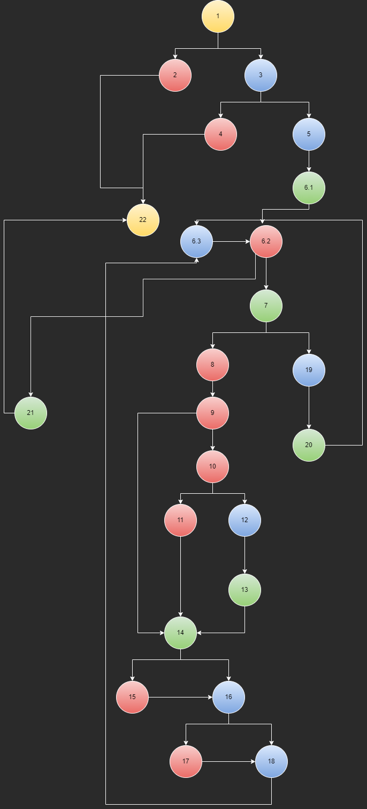

# SI_2022_lab2_206043

Кристина Фурнаџиска 206043

2. Control Flow Graph

3. Цикломатската комплексност може да се добие преку изразот: број на ребра - број на јазли + 2. Во случајот тоа би било
   31 - 24 + 2 = 9
   
4. Every statement критериумот укажува на тестови кои треба да ги изминат сите јазли во графот. Во овој случај тоа може да  
   се постигне преку три теста. Првиот е оној во кој ќе ни се јави исклучок за тоа дека листата е празна -> се поминуваат 
   јазлите 1, 2, 22. Вториот случај е кога бројот на елементи не создава перфектен квадрат, list = [“0”,” 0”, “ #”]. Се  
   поминуваат јазлите 1, 3, 4, 22 и последниот случај е кога имаме регуларна листа во која ќе се опфати целиот код на пр. 
   list = ["0", "#", "0", "#", "0", "#", "0", "#", "#"] при што се поминуваат јазлите 1, 3, 5 : 22.

   | Node | List = [] | List = ["0", "0", "#"]  | List = ["0", "#", "0", "#", "0", "#", "0", "#", "#"] |
   |:-----|:---------:|:-----------------------:|:----------------------------------------------------:|
   | 1    |     *     |            *            |                          *                           |
   | 2    |     *     |                         |                                                      |
   | 3    |           |            *            |                          *                           |
   | 4    |           |            *            |                                                      |
   | 5    |           |                         |                          *                           |
   | 6    |           |                         |                          *                           |
   | 7    |           |                         |                          *                           |
   | 8    |           |                         |                          *                           |
   | 9    |           |                         |                          *                           |
   | 10   |           |                         |                          *                           |
   | 11   |           |                         |                          *                           |
   | 12   |           |                         |                          *                           |
   | 13   |           |                         |                          *                           |
   | 14   |           |                         |                          *                           |
   | 15   |           |                         |                          *                           |
   | 16   |           |                         |                          *                           |
   | 17   |           |                         |                          *                           |
   | 18   |           |                         |                          *                           |
   | 19   |           |                         |                          *                           |
   | 20   |           |                         |                          *                           |
   | 21   |           |                         |                          *                           |
   | 22   |     *     |            *            |                          *                           |

5. Every branch критериумот укажува на тестови со кои треба да се изминат сите ребра во графот. Во овој случај тоа се 31. 
   Истите ќе бидат изминати со горенаведените тестови. Кога имаме празна листа се изминуваат 1 -> 2, 2 -> 22. Кога бројот на елементи
   не е перфектен квадрат имаме 1 -> 3, 3 -> 4, 4 -> 22 и последно кај нормална листа ќе бидат изминати сите исклучувајќи ги
   1 -> 2, 2 -> 22, 3 -> 4, 4 -> 22. 

   |            |          |             |
   |:-----------|:--------:|:-----------:|
   | 1 -> 2     | 9 -> 10  |  17 -> 18   |
   | 1 -> 3     | 10 -> 11 |  16 -> 18   |
   | 2 -> 22    | 9 -> 14  |  18 -> 6.3  |
   | 3 -> 4     | 11 -> 14 | 6.3 -> 6.2  |
   | 4 -> 22    | 10 -> 12 |   7 -> 19   |
   | 3 -> 5     | 12 -> 13 |  19 -> 20   |
   | 5 -> 6.1   | 13 -> 14 |  20 -> 6.3  |
   | 6.1 -> 6.2 | 14 -> 15 |  6.2 -> 21  |
   | 6.2 -> 7   | 15 -> 16 |  21 -> 22   |
   | 7 -> 8     | 14 -> 16 |             |
   | 8 -> 9     | 16 -> 17 |             |

6. Има две групи на тестови. Првата е за листи кои ги исполнуваат условите за бројот на елементи. Се споредува она што сакаме да го
   добиеме со наш дефиниран влез. Додека втората група е тестирање на исклучоците кои може да се појават и се проверува дали соодветно 
   се фрлаат исклучоците што ги сакаме. 
